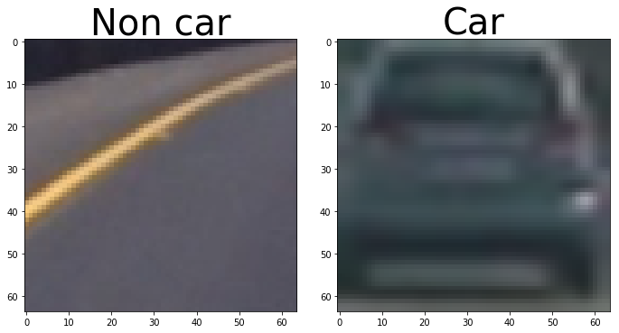
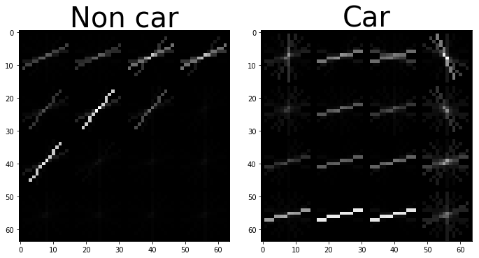
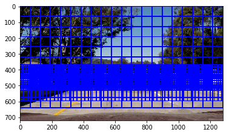
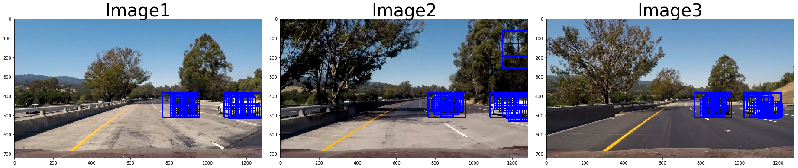
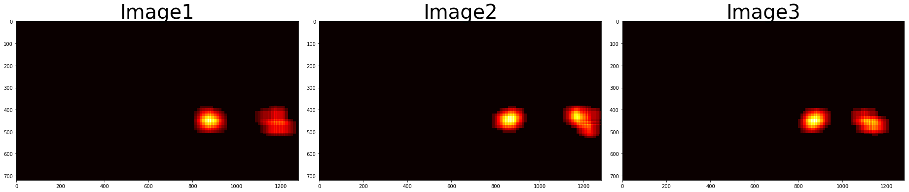
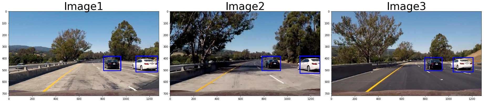

# Vehicle Detection Project

The goals / steps of this project are the following:

* Perform a Histogram of Oriented Gradients (HOG) feature extraction on a labeled training set of images and train a classifier Linear SVM classifier
* Applied a color transform and append binned color features, as well as histograms of color, to your HOG feature vector.
* Normalize your features and randomize a selection for training and testing.
* Implement a sliding-window technique and use  trained classifier to search for vehicles in images.
* Run your pipeline on a video stream on full project_video.mp4 and create a heat map of recurring detections frame by frame to reject outliers and follow detected vehicles.
* Estimate a bounding box for vehicles detected.


```python
import matplotlib.image as mpimg
import numpy as np
import cv2
from skimage.feature import hog
from tqdm import tqdm

import matplotlib.image as mpimg
import matplotlib.pyplot as plt
import numpy as np
import cv2
import glob
import time
from sklearn.svm import LinearSVC
from sklearn.preprocessing import StandardScaler
from skimage.feature import hog

# NOTE: the next import is only valid for scikit-learn version <= 0.17
# for scikit-learn >= 0.18 use:
# from sklearn.model_selection import train_test_split
from sklearn.cross_validation import train_test_split
# Define a function to return HOG features and visualization

def get_hog_features(img, orient, pix_per_cell, cell_per_block, 
                        vis=False, feature_vec=True):
    # Call with two outputs if vis==True
    if vis == True:
        features, hog_image = hog(img, orientations=orient, 
                                  pixels_per_cell=(pix_per_cell, pix_per_cell),
                                  block_norm= 'L2-Hys',
                                  cells_per_block=(cell_per_block, cell_per_block), 
                                  transform_sqrt=False, 
                                  visualise=vis, feature_vector=feature_vec)
        return features, hog_image
    # Otherwise call with one output
    else:      
        features = hog(img, orientations=orient, 
                       pixels_per_cell=(pix_per_cell, pix_per_cell),
                       cells_per_block=(cell_per_block, cell_per_block), 
                       block_norm= 'L2-Hys',
                       transform_sqrt=True, 
                       visualise=vis, feature_vector=feature_vec)
        return features

# Define a function to compute binned color features  
def bin_spatial(img, size=(32, 32)):
    # Use cv2.resize().ravel() to create the feature vector
    features = cv2.resize(img, size).ravel() 
    # Return the feature vector
    return features

# Define a function to compute color histogram features 
# NEED TO CHANGE bins_range if reading .png files with mpimg!
def color_hist(img, nbins=32, bins_range=(0, 256)):
    # Compute the histogram of the color channels separately
    channel1_hist = np.histogram(img[:,:,0], bins=nbins, range=bins_range)
    channel2_hist = np.histogram(img[:,:,1], bins=nbins, range=bins_range)
    channel3_hist = np.histogram(img[:,:,2], bins=nbins, range=bins_range)
    # Concatenate the histograms into a single feature vector
    hist_features = np.concatenate((channel1_hist[0], channel2_hist[0], channel3_hist[0]))
    # Return the individual histograms, bin_centers and feature vector
    return hist_features

# Define a function to extract features from a list of images
# Have this function call bin_spatial() and color_hist()
def extract_features(imgs, color_space='RGB', spatial_size=(32, 32),
                        hist_bins=32, orient=9, 
                        pix_per_cell=8, cell_per_block=2, hog_channel=0,
                        spatial_feat=True, hist_feat=True, hog_feat=True):
    # Create a list to append feature vectors to
    features = []
    # Iterate through the list of images
    for file in tqdm(imgs,desc='extracting features:'):
        file_features = []
        # Read in each one by one
        image = mpimg.imread(file)
#         image1 = cv2.imread(file)
#         image = image1[...,::-1]
        # apply color conversion if other than 'RGB'
        if color_space != 'RGB':
            if color_space == 'HSV':
                feature_image = cv2.cvtColor(image, cv2.COLOR_RGB2HSV)
            elif color_space == 'LUV':
                feature_image = cv2.cvtColor(image, cv2.COLOR_RGB2LUV)
            elif color_space == 'HLS':
                feature_image = cv2.cvtColor(image, cv2.COLOR_RGB2HLS)
            elif color_space == 'YUV':
                feature_image = cv2.cvtColor(image, cv2.COLOR_RGB2YUV)
            elif color_space == 'YCrCb':
                feature_image = cv2.cvtColor(image, cv2.COLOR_RGB2YCrCb)
        else: feature_image = np.copy(image)      

        if spatial_feat == True:
            spatial_features = bin_spatial(feature_image, size=spatial_size)
            file_features.append(spatial_features)
        if hist_feat == True:
            # Apply color_hist()
            hist_features = color_hist(feature_image, nbins=hist_bins)
            file_features.append(hist_features)
        if hog_feat == True:
        # Call get_hog_features() with vis=False, feature_vec=True
            if hog_channel == 'ALL':
                hog_features = []
                for channel in range(feature_image.shape[2]):
                    hog_features.append(get_hog_features(feature_image[:,:,channel], 
                                        orient, pix_per_cell, cell_per_block, 
                                        vis=False, feature_vec=True))
                hog_features = np.ravel(hog_features)        
            else:
                hog_features = get_hog_features(feature_image[:,:,hog_channel], orient, 
                            pix_per_cell, cell_per_block, vis=False, feature_vec=True)
            # Append the new feature vector to the features list
            file_features.append(hog_features)
        features.append(np.concatenate(file_features))
    # Return list of feature vectors
    return features
    
# Define a function that takes an image,
# start and stop positions in both x and y, 
# window size (x and y dimensions),  
# and overlap fraction (for both x and y)
def slide_window(img, x_start_stop=[None, None], y_start_stop=[None, None], 
                    xy_window=(64, 64), xy_overlap=(0.5, 0.5)):
    # If x and/or y start/stop positions not defined, set to image size
    if x_start_stop[0] == None:
        x_start_stop[0] = 0
    if x_start_stop[1] == None:
        x_start_stop[1] = img.shape[1]
    if y_start_stop[0] == None:
        y_start_stop[0] = 0
    if y_start_stop[1] == None:
        y_start_stop[1] = img.shape[0]
    # Compute the span of the region to be searched    
    xspan = x_start_stop[1] - x_start_stop[0]
    yspan = y_start_stop[1] - y_start_stop[0]
    # Compute the number of pixels per step in x/y
    nx_pix_per_step = np.int(xy_window[0]*(1 - xy_overlap[0]))
    ny_pix_per_step = np.int(xy_window[1]*(1 - xy_overlap[1]))
    # Compute the number of windows in x/y
    nx_buffer = np.int(xy_window[0]*(xy_overlap[0]))
    ny_buffer = np.int(xy_window[1]*(xy_overlap[1]))
    nx_windows = np.int((xspan-nx_buffer)/nx_pix_per_step) 
    ny_windows = np.int((yspan-ny_buffer)/ny_pix_per_step) 
    # Initialize a list to append window positions to
    window_list = []
    # Loop through finding x and y window positions
    # Note: you could vectorize this step, but in practice
    # you'll be considering windows one by one with your
    # classifier, so looping makes sense
    for ys in range(ny_windows):
        for xs in range(nx_windows):
            # Calculate window position
            startx = xs*nx_pix_per_step + x_start_stop[0]
            endx = startx + xy_window[0]
            starty = ys*ny_pix_per_step + y_start_stop[0]
            endy = starty + xy_window[1]
            
            # Append window position to list
            window_list.append(((startx, starty), (endx, endy)))
    # Return the list of windows
    return window_list

# Define a function to draw bounding boxes
def draw_boxes(img, bboxes, color=(0, 0, 255), thick=6):
    # Make a copy of the image
    imcopy = np.copy(img)
    # Iterate through the bounding boxes
    for bbox in bboxes:
        # Draw a rectangle given bbox coordinates
        cv2.rectangle(imcopy, bbox[0], bbox[1], color, thick)
    # Return the image copy with boxes drawn
    return imcopy


# Define a function to extract features from a single image window
# This function is very similar to extract_features()
# just for a single image rather than list of images
# Define a function to extract features from a single image window
# This function is very similar to extract_features()
# just for a single image rather than list of images
def single_img_features(img, color_space='RGB', spatial_size=(32, 32),
                        hist_bins=32, orient=9, 
                        pix_per_cell=8, cell_per_block=2, hog_channel=0,
                        spatial_feat=True, hist_feat=True, hog_feat=True):    
    #1) Define an empty list to receive features
    img_features = []
    #2) Apply color conversion if other than 'RGB'
    if color_space != 'RGB':
        if color_space == 'HSV':
            feature_image = cv2.cvtColor(img, cv2.COLOR_RGB2HSV)
        elif color_space == 'LUV':
            feature_image = cv2.cvtColor(img, cv2.COLOR_RGB2LUV)
        elif color_space == 'HLS':
            feature_image = cv2.cvtColor(img, cv2.COLOR_RGB2HLS)
        elif color_space == 'YUV':
            feature_image = cv2.cvtColor(img, cv2.COLOR_RGB2YUV)
        elif color_space == 'YCrCb':
            feature_image = cv2.cvtColor(img, cv2.COLOR_RGB2YCrCb)
    else: feature_image = np.copy(img)      
    #3) Compute spatial features if flag is set
    if spatial_feat == True:
        spatial_features = bin_spatial(feature_image, size=spatial_size)
        #4) Append features to list
        img_features.append(spatial_features)
    #5) Compute histogram features if flag is set
    if hist_feat == True:
        hist_features = color_hist(feature_image, nbins=hist_bins)
        #6) Append features to list
        img_features.append(hist_features)
    #7) Compute HOG features if flag is set
    if hog_feat == True:
        if hog_channel == 'ALL':
            hog_features = []
            for channel in range(feature_image.shape[2]):
                hog_features.extend(get_hog_features(feature_image[:,:,channel], 
                                    orient, pix_per_cell, cell_per_block, 
                                    vis=False, feature_vec=True))      
        else:
            hog_features = get_hog_features(feature_image[:,:,hog_channel], orient, 
                        pix_per_cell, cell_per_block, vis=False, feature_vec=True)
        #8) Append features to list
        img_features.append(hog_features)

    #9) Return concatenated array of features
    return np.concatenate(img_features)

# Define a function you will pass an image 
# and the list of windows to be searched (output of slide_windows())
def search_windows(img, windows, clf, scaler, color_space='RGB', 
                    spatial_size=(32, 32), hist_bins=32, 
                    hist_range=(0, 256), orient=9, 
                    pix_per_cell=8, cell_per_block=2, 
                    hog_channel=0, spatial_feat=True, 
                    hist_feat=True, hog_feat=True):

    #1) Create an empty list to receive positive detection windows
    on_windows = []
    #2) Iterate over all windows in the list
    for window in windows:
        #3) Extract the test window from original image
        test_img = cv2.resize(img[window[0][1]:window[1][1], window[0][0]:window[1][0]], (64, 64))      
        #4) Extract features for that window using single_img_features()
        features = single_img_features(test_img, color_space=color_space, 
                            spatial_size=spatial_size, hist_bins=hist_bins, 
                            orient=orient, pix_per_cell=pix_per_cell, 
                            cell_per_block=cell_per_block, 
                            hog_channel=hog_channel, spatial_feat=spatial_feat, 
                            hist_feat=hist_feat, hog_feat=hog_feat)
        #5) Scale extracted features to be fed to classifier
        test_features = scaler.transform(np.array(features).reshape(1, -1))
        #6) Predict using your classifier
        prediction = clf.predict(test_features)
        #7) If positive (prediction == 1) then save the window
        if prediction == 1:
            on_windows.append(window)
    #8) Return windows for positive detections
    return on_windows

    
```

## Below is one of the training images we have taken for training our SVM classifier


```python

cars = []
notcars = []
notcars = glob.glob('non-vehicles\**\*.png',recursive=True)
cars = glob.glob('vehicles\**\*.png',recursive=True)
print(len(notcars))
print(len(cars))

f, [ax1, ax2] = plt.subplots(1, 2, figsize=(9, 9))
f.tight_layout()
ax1.imshow(mpimg.imread(notcars[10]),cmap='gray')
ax1.set_title('Non car', fontsize=40)
ax2.imshow(mpimg.imread(cars[10]),cmap='gray')
ax2.set_title('Car', fontsize=40)
plt.subplots_adjust(left=0., right=1, top=2, bottom=0.)


```

    8968
    8872
    





### In the below cell we are extracting the spatial,histogram colors and spatial bins features 


```python
### TODO: Tweak these parameters and see how the results change.
color_space = 'YCrCb' # Can be RGB, HSV, LUV, HLS, YUV, YCrCb
orient = 9  # HOG orientations
pix_per_cell = 16 # HOG pixels per cell
cell_per_block = 4 # HOG cells per block
hog_channel = 'ALL' # Can be 0, 1, 2, or "ALL"
spatial_size = (16, 16) # Spatial binning dimensions
hist_bins = 16    # Number of histogram bins
spatial_feat = True # Spatial features on or off
hist_feat =True # Histogram features on or off
hog_feat = True # HOG features on or off
y_start_stop = [300, None] # Min and max in y to search in slide_window()

car_features = extract_features(cars, color_space=color_space, 
                        spatial_size=spatial_size, hist_bins=hist_bins, 
                        orient=orient, pix_per_cell=pix_per_cell, 
                        cell_per_block=cell_per_block, 
                        hog_channel=hog_channel, spatial_feat=spatial_feat, 
                        hist_feat=hist_feat, hog_feat=hog_feat)
notcar_features = extract_features(notcars, color_space=color_space, 
                        spatial_size=spatial_size, hist_bins=hist_bins, 
                        orient=orient, pix_per_cell=pix_per_cell, 
                        cell_per_block=cell_per_block, 
                        hog_channel=hog_channel, spatial_feat=spatial_feat, 
                        hist_feat=hist_feat, hog_feat=hog_feat)


```

    extracting features:: 100%|███████████████████████████████████████████████████████| 8872/8872 [00:29<00:00, 304.41it/s]
    extracting features:: 100%|███████████████████████████████████████████████████████| 8968/8968 [00:28<00:00, 318.20it/s]
    

# Histogram of Oriented Gradients (HOG)

* I then explored different color spaces and different skimage.hog() parameters (orientations, pixels_per_cell, and cells_per_block). I grabbed  images from each of the two classes and displayed them to get a feel for what the skimage.hog() output looks like.

* I tried various combinations of parameters and HOG parameters of orientations=9, pixels_per_cell=(16, 16) and cells_per_block=(4, 4) are the best combination which had a good output on video.

* Here is an example using the YCrCb color space and HOG parameters of orientations=9, pixels_per_cell=(16, 16) and cells_per_block=(4, 4):


```python

image_car=mpimg.imread(cars[10])
image_carnot=mpimg.imread(notcars[10])
image_car = cv2.cvtColor(image_car, cv2.COLOR_RGB2YCrCb)
image_carnot = cv2.cvtColor(image_carnot, cv2.COLOR_RGB2YCrCb)
features_car=get_hog_features(image_car[:,:,0], 
                                    orient, pix_per_cell, cell_per_block, 
                                    vis=True, feature_vec=True)
features_notcar=get_hog_features(image_carnot[:,:,0], 
                                    orient, pix_per_cell, cell_per_block, 
                                    vis=True, feature_vec=True)
f, [ax1, ax2] = plt.subplots(1, 2, figsize=(9, 9))
f.tight_layout()
ax1.imshow((features_notcar[1]),cmap='gray')
ax1.set_title('Non car', fontsize=40)
ax2.imshow((features_car[1]),cmap='gray')
ax2.set_title('Car', fontsize=40)
plt.subplots_adjust(left=0., right=1, top=2, bottom=0.)
```





# Training the classifier

I trained a SVM classifier with the combined features(HOG features,histogram color and spatial bin).Then I scaled them to equal proportion so that one feature does not dominate the other. I used rbf kernel as it was performing better than linear. I used C=2 which gave me better results than default of C=1.0 as it was penalizing the wrong images better.

## **Dealing with the false positives**:
Changing the filter from linear to rbf kernel grealty reduced the false positives. Even then there were some false postives so I increased the values of C to 2 so that it could classify much more better. Then the false positives decreased close to negligible.


```python
# Create an array stack of feature vectors
from sklearn.svm import SVC
X = np.vstack((car_features, notcar_features)).astype(np.float64)

# Define the labels vector
y = np.hstack((np.ones(len(car_features)), np.zeros(len(notcar_features))))

# Split up data into randomized training and test sets
rand_state = np.random.randint(0, 100)
X_train, X_test, y_train, y_test = train_test_split(
    X, y, test_size=0.2, random_state=rand_state)
    
# Fit a per-column scaler
X_scaler = StandardScaler().fit(X_train)
# Apply the scaler to X
X_train = X_scaler.transform(X_train)
X_test = X_scaler.transform(X_test)

print('Using:',orient,'orientations',pix_per_cell,
    'pixels per cell and', cell_per_block,'cells per block')
print('Feature vector length:', len(X_train[0]))
# Use a linear SVC 
svc = SVC(C=2)
# Check the training time for the SVC
t=time.time()
svc.fit(X_train, y_train)
t2 = time.time()
print(round(t2-t, 2), 'Seconds to train SVC...')
# Check the score of the SVC
print('Test Accuracy of SVC = ', round(svc.score(X_test, y_test), 4))
# Check the prediction time for a single sample


```

    Using: 9 orientations 16 pixels per cell and 4 cells per block
    Feature vector length: 1248
    41.25 Seconds to train SVC...
    Test Accuracy of SVC =  0.9961
    


```python
import pickle
model_params = {
          'model' : svc,
          'scaler' : X_scaler,
        
      }
pickle_out = open("mymodelfinal.pkl","wb")
pickle.dump(model_params, pickle_out)
pickle_out.close()
```

# Sliding Window Search

I took three window sizes:
* 128 x 128 - To detect large car images which are closer to our car
* 96 x 96 - To detect farther car (not to far & not to close )
* 64 x 64 - To detect much more farther car from our car.As these car will be seen smaller in the image small window size should be taken to detect it.


```python
image = mpimg.imread('test_images/test5.jpg')
image1 = mpimg.imread('test_images/test1.jpg')
image2 = mpimg.imread('test_images/test5.jpg')
image3 = mpimg.imread('test_images/test6.jpg')


# Uncomment the following line if you extracted training
# data from .png images (scaled 0 to 1 by mpimg) and the
# image you are searching is a .jpg (scaled 0 to 255)


windows = slide_window(image, x_start_stop=[None, None], y_start_stop=[None,690], 
                    xy_window=(128, 128), xy_overlap=(0.5, 0.5))
windows2 = slide_window(image, x_start_stop=[None, None], y_start_stop=[370,540], 
                    xy_window=(64, 64), xy_overlap=(0.80, 0.80))
windows3 = slide_window(image, x_start_stop=[None, None], y_start_stop=[500,600], 
                    xy_window=(96, 96), xy_overlap=(0.75, 0.75))
windows.extend(windows2)
print(len(windows))
windows.extend(windows3)
print(len(windows))
```

    1089
    1139
    


```python
window_img = draw_boxes(image, windows, color=(0, 0, 255), thick=6)
plt.imshow(window_img)
```


    <matplotlib.image.AxesImage at 0x236c7165240>





```python
def add_heat(heatmap, bbox_list):
    # Iterate through list of bboxes
    for box in bbox_list:
        # Add += 1 for all pixels inside each bbox
        # Assuming each "box" takes the form ((x1, y1), (x2, y2))
        heatmap[box[0][1]:box[1][1], box[0][0]:box[1][0]] += 1

    # Return updated heatmap
    return heatmap# Iterate through list of bboxes
    
def apply_threshold(heatmap, threshold):
    # Zero out pixels below the threshold
    heatmap[heatmap <= threshold] = 0
    # Return thresholded map
    return heatmap

def draw_labeled_bboxes(img, labels):
    # Iterate through all detected cars
    for car_number in range(1, labels[1]+1):
        # Find pixels with each car_number label value
        nonzero = (labels[0] == car_number).nonzero()
        # Identify x and y values of those pixels
        nonzeroy = np.array(nonzero[0])
        nonzerox = np.array(nonzero[1])
        # Define a bounding box based on min/max x and y
        bbox = ((np.min(nonzerox), np.min(nonzeroy)), (np.max(nonzerox), np.max(nonzeroy)))
        # Draw the box on the image
        cv2.rectangle(img, bbox[0], bbox[1], (0,0,255), 6)
    # Return the image
    return img

```

# Test images output :

I searched on three window scales using YCrCb 3-channel HOG features plus spatially binned color and histograms of color in the feature vector, which provided a nice result. Here are some example images:


```python
draw_image = np.copy(image1)
image1 = image1.astype(np.float32)/255
hot_windows1 = search_windows(image1, windows, svc, X_scaler, color_space=color_space, 
                            spatial_size=spatial_size, hist_bins=hist_bins, 
                            orient=orient, pix_per_cell=pix_per_cell, 
                            cell_per_block=cell_per_block, 
                            hog_channel=hog_channel, spatial_feat=spatial_feat, 
                            hist_feat=hist_feat, hog_feat=hog_feat)    
window_img1 = draw_boxes(draw_image, hot_windows1, color=(0, 0, 255), thick=6)

draw_image = np.copy(image2)
image2 = image2.astype(np.float32)/255
hot_windows2 = search_windows(image2, windows, svc, X_scaler, color_space=color_space, 
                            spatial_size=spatial_size, hist_bins=hist_bins, 
                            orient=orient, pix_per_cell=pix_per_cell, 
                            cell_per_block=cell_per_block, 
                            hog_channel=hog_channel, spatial_feat=spatial_feat, 
                            hist_feat=hist_feat, hog_feat=hog_feat)    
window_img2 = draw_boxes(draw_image, hot_windows2, color=(0, 0, 255), thick=6)

draw_image = np.copy(image3)
image3 = image3.astype(np.float32)/255
hot_windows3 = search_windows(image3, windows, svc, X_scaler, color_space=color_space, 
                            spatial_size=spatial_size, hist_bins=hist_bins, 
                            orient=orient, pix_per_cell=pix_per_cell, 
                            cell_per_block=cell_per_block, 
                            hog_channel=hog_channel, spatial_feat=spatial_feat, 
                            hist_feat=hist_feat, hog_feat=hog_feat)    
window_img3 = draw_boxes(draw_image, hot_windows3, color=(0, 0, 255), thick=6)

f, [ax1, ax2,ax3] = plt.subplots(1, 3, figsize=(25, 9))
f.tight_layout()
ax1.imshow(window_img1,cmap='gray')
ax1.set_title('Image1', fontsize=40)
ax2.imshow(window_img2,cmap='gray')
ax2.set_title('Image2', fontsize=40)
ax3.imshow(window_img3,cmap='gray')
ax3.set_title('Image3', fontsize=40)
plt.subplots_adjust(left=0., right=1, top=2, bottom=0.)
```





# Heat map

I recorded the positions of positive detections in each frame of the video. From the positive detections I created a heatmap and then thresholded that map to identify vehicle positions. I then used scipy.ndimage.measurements.label() to identify individual blobs in the heatmap. I then assumed each blob corresponded to a vehicle. I constructed bounding boxes to cover the area of each blob detected.

Here's an example result showing the heatmap from a series of frames of video, the result of scipy.ndimage.measurements.label() and the bounding boxes then overlaid on the last frame of video:


```python

heat = np.zeros_like(draw_image[:,:,0]).astype(np.float)
heat = add_heat(heat,hot_windows1)
heat = apply_threshold(heat,2)
# Visualize the heatmap when displaying    
heatmap1 = np.clip(heat, 0, 255)

heat = np.zeros_like(draw_image[:,:,0]).astype(np.float)
heat = add_heat(heat,hot_windows2)
heat = apply_threshold(heat,2)
# Visualize the heatmap when displaying    
heatmap2 = np.clip(heat, 0, 255)

heat = np.zeros_like(draw_image[:,:,0]).astype(np.float)
heat = add_heat(heat,hot_windows3)
heat = apply_threshold(heat,2)
# Visualize the heatmap when displaying    
heatmap3 = np.clip(heat, 0, 255)


f, [ax1, ax2,ax3] = plt.subplots(1, 3, figsize=(25, 9))
f.tight_layout()
ax1.imshow(heatmap1,cmap='hot')
ax1.set_title('Image1', fontsize=40)
ax2.imshow(heatmap2,cmap='hot')
ax2.set_title('Image2', fontsize=40)
ax3.imshow(heatmap3,cmap='hot')
ax3.set_title('Image3', fontsize=40)
plt.subplots_adjust(left=0., right=1, top=2, bottom=0.)

```





# Final output: 


```python
from scipy.ndimage.measurements import label
labels1 = label(heatmap1)
labels2 = label(heatmap2)
labels3 = label(heatmap3)
draw_img1 = draw_labeled_bboxes(np.copy(image1), labels1)
draw_img2 = draw_labeled_bboxes(np.copy(image2), labels2)
draw_img3 = draw_labeled_bboxes(np.copy(image3), labels3)
    
    
f, [ax1, ax2,ax3] = plt.subplots(1, 3, figsize=(25, 9))
f.tight_layout()
ax1.imshow(draw_img1,cmap='hot')
ax1.set_title('Image1', fontsize=40)
ax2.imshow(draw_img2,cmap='hot')
ax2.set_title('Image2', fontsize=40)
ax3.imshow(draw_img3,cmap='hot')
ax3.set_title('Image3', fontsize=40)
plt.subplots_adjust(left=0., right=1, top=2, bottom=0.)
```





# Final Pipeline:


```python
heat_queue=[]

frame_count=1;
avg_hot=[]
def pipeline(image):
    global heat_queue
    hot_windows=[]
    global frame_count
    global avg_hot
    orig_img=np.copy(image)
    draw_image = np.copy(image)
    image = image.astype(np.float32)/255
    
    hot_windows = search_windows(image, windows, svc, X_scaler, color_space=color_space, 
                            spatial_size=spatial_size, hist_bins=hist_bins, 
                            orient=orient, pix_per_cell=pix_per_cell, 
                            cell_per_block=cell_per_block, 
                            hog_channel=hog_channel, spatial_feat=spatial_feat, 
                            hist_feat=hist_feat, hog_feat=hog_feat)    
    window_img = draw_boxes(draw_image, hot_windows, color=(0, 0, 255), thick=6)                    
    heat = np.zeros_like(image[:,:,0]).astype(np.float)
    new_heat = np.zeros_like(image[:,:,0]).astype(np.float)
    heat = add_heat(heat,hot_windows)
    
    # Averaging the heat map output
    if(len(heat_queue)==0):
        for i in range(7):
            heat_queue.append(heat)
    else:
        heat_queue=heat_queue[1:]
        heat_queue.append(heat)
    for h in range(7):
        new_heat+=heat_queue[h]
    
    
    # Apply threshold to help remove false positives
    heat = apply_threshold(new_heat,25)
    
    # Visualize the heatmap when displaying    
    heatmap = np.clip(heat, 0, 255)
    
    # Find final boxes from heatmap using label function
    labels = label(heatmap)
#     print(labels)
    draw_img = draw_labeled_bboxes(np.copy(orig_img), labels)
    frame_count+=1
    return window_img


    
# image = mpimg.imread('test_images/test5.jpg')
# print(image.shape)
# plt.imshow(pipeline(image))
```


```python
odd=0;
import os

from moviepy.video.VideoClip import VideoClip
from moviepy.editor import VideoFileClip
from IPython.display import HTML
white_output = 'project_video_final.mp4'
# clip1 = VideoFileClip("test_videos/solidWhiteRight.mp4").subclip(37,42)
clip1 = VideoFileClip("project_video.mp4")#.subclip(30,50)
white_clip = clip1.fl_image(pipeline) #NOTE: this function expects color images!!

%time white_clip.write_videofile(white_output, audio=False)


```


```python
HTML("""
<video width="960" height="540" controls>
  <source src="{0}">
</video>
""".format(white_output))
```

# Discussion 

I used hog features,color histogram and spatial bin features to train the svm classifier.I used non linear SVM classifier which was better for classiifying and decreased false positives. It will fail when there is different lighning conditions and car is distant.For the lightning condition I may augment more data with different brightness. I would train using much more reliable classifier i.e the CNN so that it can detect distant images much more efficiently.
# CarND-Vehicle-Detection
